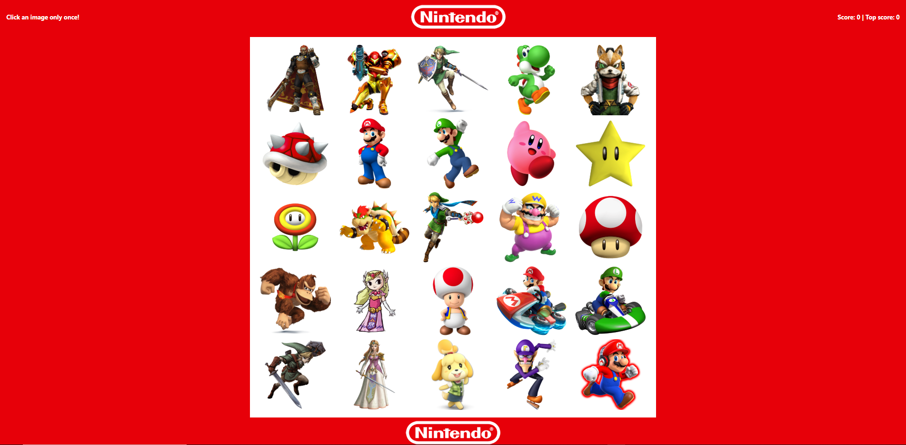
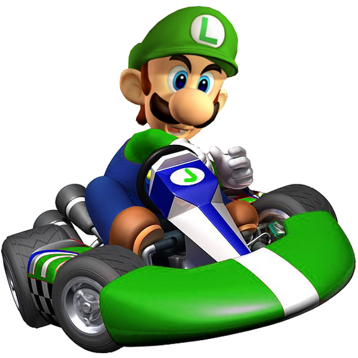

# Nintendo-Clicky-Game

## Purpose:

A React.js application using components to build the UI, manages component state, and responds to user events.

## Description

Test your memory... Click on a Nintendo character and try to click on all characters without clicking on the same character twice. 
The application will increment your score for each image you click the first time. If you click on a character twice... 
**Game Over**.

## Characters:

* Mario                 
* Luigi               
* Princess Peach      
* Toadstool           
* Link
* Princess Zelda
* Ganon
* Donkey Kong
* King Koopa
* Fire Flower
* Mushroom
* Star
* Wario
* WaLuigi
* Isabelle
* Samus
* Kirby
* Yoshi
* Red Shell

Link to game: [Nintendo Clicky Game!!!](https://aqueous-falls-51327.herokuapp.com/)

## Technology

    * React
    * Bootstrap

    

